# 🏥 Hospital Management System - PHP MVC


> **Complete hospital management system built with PHP MVC architecture. Manage patients, visits, prescriptions, and pharmaceutical inventory with role-based access control.**

[](https://github.com/Ahmed-Senan-Al-Aini/Hospital-Management-System)
[](https://github.com/Ahmed-Senan-Al-Aini/Hospital-Management-System/issues)

---

## 📌 Table of Contents
- [Features](#-features)
- [Technologies](#-technologies)
- [Installation](#-installation)
- [User Roles](#-user-roles)
- [Project Structure](#-project-structure)
- [Screenshots](#-screenshots)
- [License](#-license)

---

## ✨ Features

| Module | Description |
|--------|-------------|
| **Dashboard** | Real-time statistics, charts, low stock alerts, expiry notifications |
| **Patient Management** | Complete patient records (national ID, blood type, medical history) |
| **Visits & Diagnosis** | Document diagnoses, link to prescriptions, historical tracking |
| **Pharmacy Inventory** | Full CRUD operations, stock movement tracking, expiry date monitoring |
| **Prescriptions** | Electronic prescriptions with status tracking (pending/dispensed/cancelled) |
| **Reports** | Medicine consumption, expiry reports, daily/monthly analytics |
| **Authentication** | Role-based access control (Admin/Doctor/Pharmacist/Secretary) |
| **Security** | CSRF protection, Bcrypt password hashing, session management |

### 🔐 Login Credentials (Demo)

| Role | Email | Password |
|------|-------|----------|
| Admin | admin@hospital.com | admin |

> ⚠️ **Change default passwords immediately after installation!**

---

## 🛠 Technologies

| Category | Technologies |
|----------|--------------|
| **Backend** | PHP 8.0+ (MVC Architecture), PDO |
| **Database** | MySQL 5.7+ |
| **Frontend** | Bootstrap 5, CSS3, FontAwesome 6 |
| **JavaScript** | jQuery, AJAX |
| **Security** | CSRF, Bcrypt, RBAC |
| **Server** | Apache / Nginx |

### Architecture Diagram
```

User Request → index.php → Router → Controller → Model → View → Response

```

---

## ⚙️ Installation (5 Minutes)

### Requirements
- PHP 8.0 or higher
- MySQL 5.7 or higher
- Apache (XAMPP/WAMP) or Nginx
- PHP PDO extension enabled

### Step-by-Step

```bash
# 1. Clone repository
git clone https://github.com/Ahmed-Senan-Al-Aini/Hospital-Management-System.git

# 2. Move to your web server directory (example for XAMPP)
mv Hospital-Management-System /opt/lampp/htdocs/

# 3. Create database
mysql -u root -p
CREATE DATABASE hospital_system;
EXIT;

# 4. Import SQL schema
mysql -u root -p hospital_system < config/Hospital_Management_System.sql

# 5. Configure database connection
# Edit config/database.php with your credentials:
# - host: localhost
# - username: root
# - password: [your password]
# - database: hospital_system

# 6. Start server and access
# http://localhost/Hospital-Management-System
```

---

### 👥 User Roles & Permissions

| Permission | Admin | Doctor | Pharmacist | Secretary |
|------------|-------|--------|------------|-----------|
| Manage Patients | ✅ | ❌ | ❌ | ✅ |
| Create Visits | ✅ | ✅ | ❌ | ✅ |
| Create Prescriptions | ✅ | ✅ | ❌ | ❌ |
| Dispense Medications | ✅ | ❌ | ✅ | ❌ |
| Manage Inventory | ✅ | ❌ | ✅ | ❌ |
| View Reports | ✅ | ❌ | ❌ | ❌ |
| Manage Users | ✅ | ❌ | ❌ | ❌ |

Authentication Flow

1. User submits login credentials
2. System validates email format and required fields
3. Password verified using Bcrypt hash
4. Session created with user role
5. Redirected to role-specific dashboard

---

📂 Project Structure

```
Hospital-Management-System/
├── config/               # Database configuration, constants
│   └── Hospital_Management_System.sql
├── controllers/          # Business logic (20+ controllers)
├── core/                 # Router, Auth, Session, Validation
├── models/               # Database queries (15+ models)
├── public/               # CSS, JS, images, fonts
│   ├── css/
│   ├── js/
│   └── uploads/
├── storage/              # Logs, cache, temporary files
├── views/                # HTML templates (30+ views)
└── index.php             # Front controller
```

---

## 📸 Screenshots

### 🖥️ Dashboard
> Real-time statistics, charts, low-stock alerts, and expiry notifications at a glance.

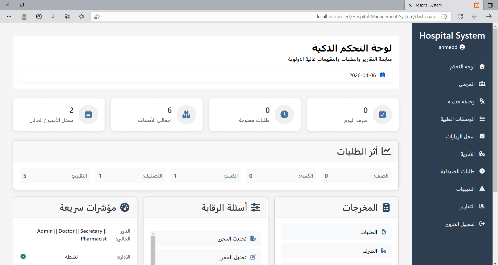

---

### 🗓️ Visits
> Manage patient visits, diagnoses, and link them directly to prescriptions.

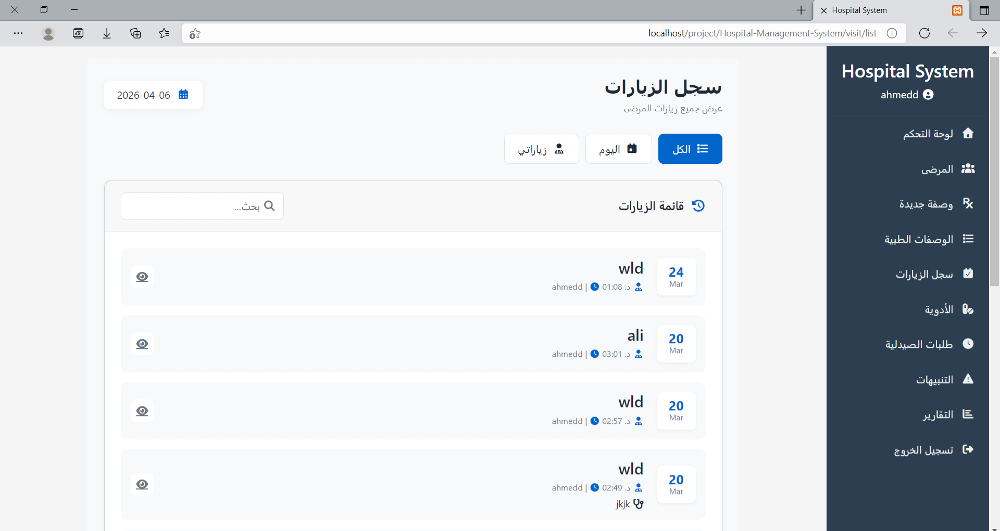

---

### 💊 Pharmacy & Inventory

#### Medicine List
> Full CRUD for the pharmacy inventory with stock tracking.

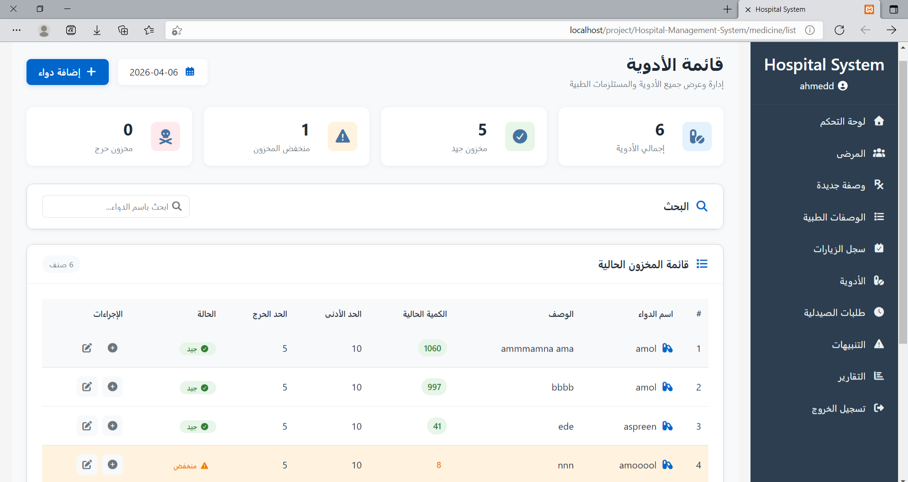

#### Medicine Alerts
> Instant notifications for low-stock and expiry warnings.

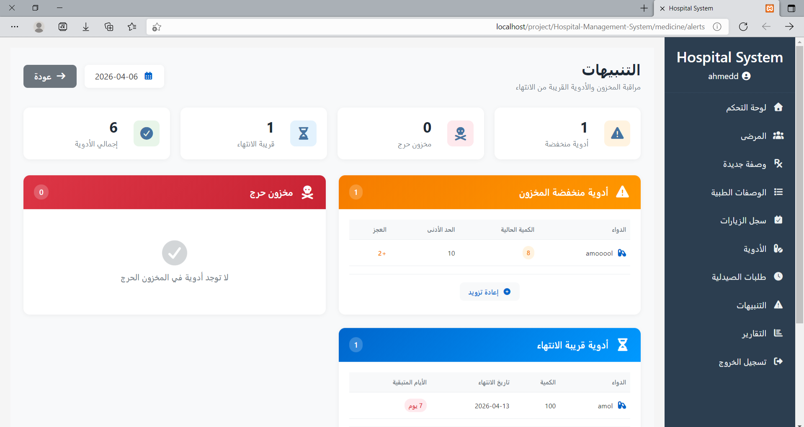

#### Pharmacy Queue
> Manage the dispensing queue in real time.

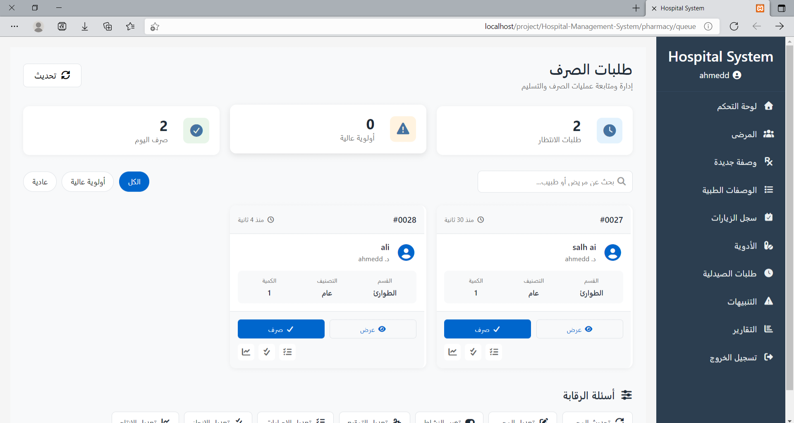

---

### 📋 Prescriptions

#### Create Prescription
> Doctors create electronic prescriptions with auto-linked medications.

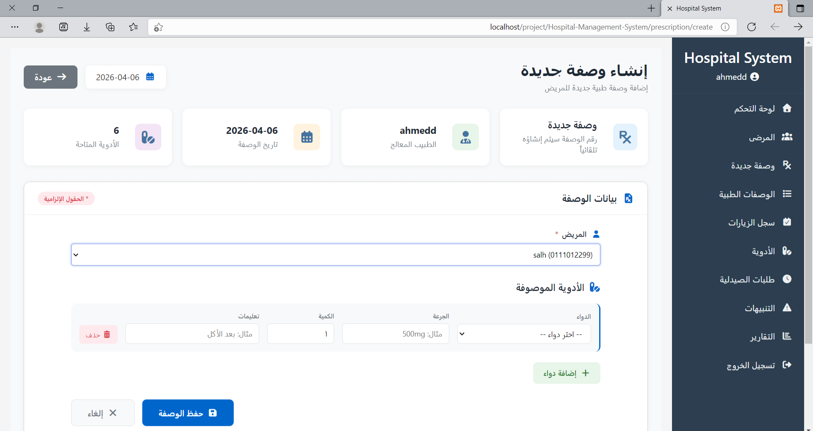

#### Prescription List
> Track all prescriptions with statuses: Pending / Dispensed / Cancelled.

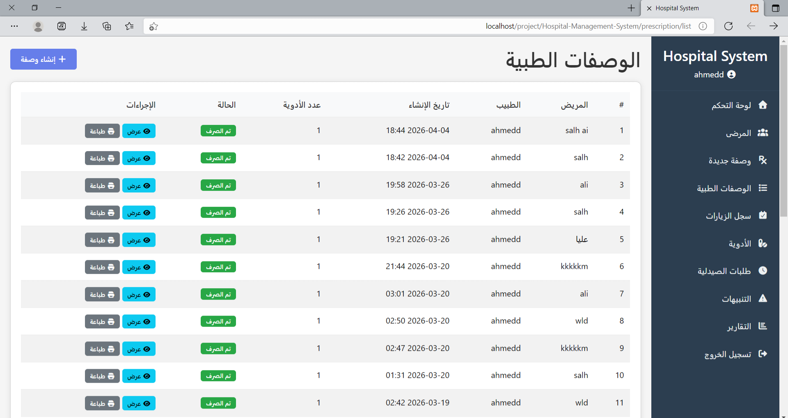

---

### 📊 Reports

#### Reports Overview
> Central hub for all analytics and reporting modules.

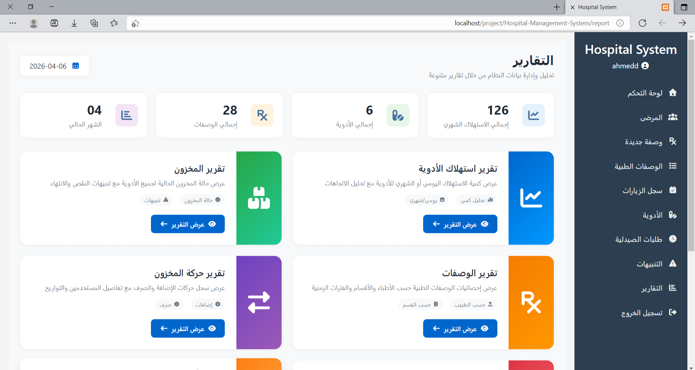

#### Medicine Consumption Report
> Monitor which medications are consumed the most over any period.

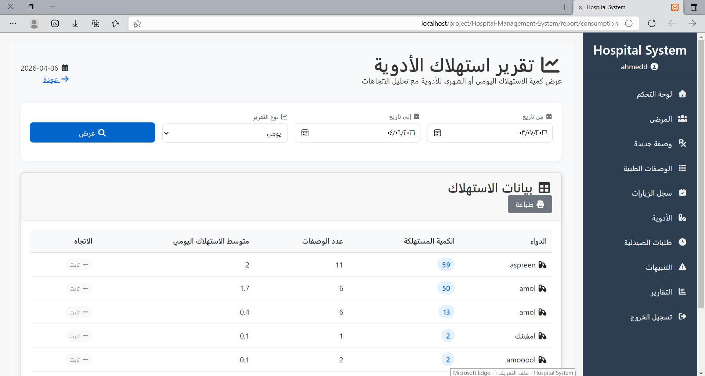

#### Expiry Report
> Identify medicines approaching or past their expiry dates.

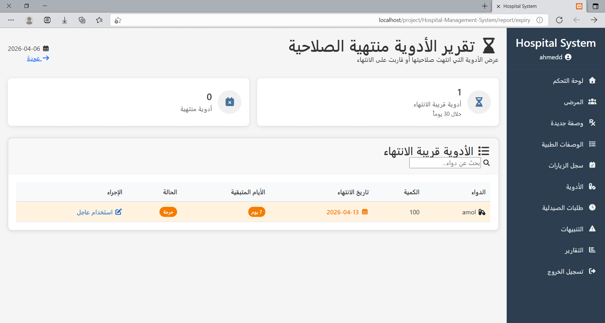

#### Low Stock Report
> Quickly spot items that need restocking before they run out.

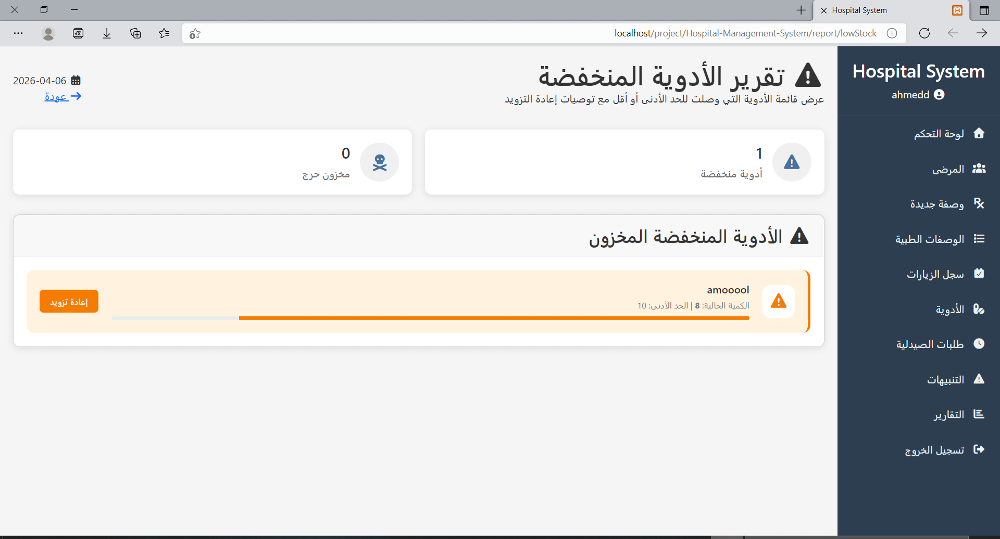

#### Stock Movement Report
> Detailed log of every stock-in and stock-out transaction.

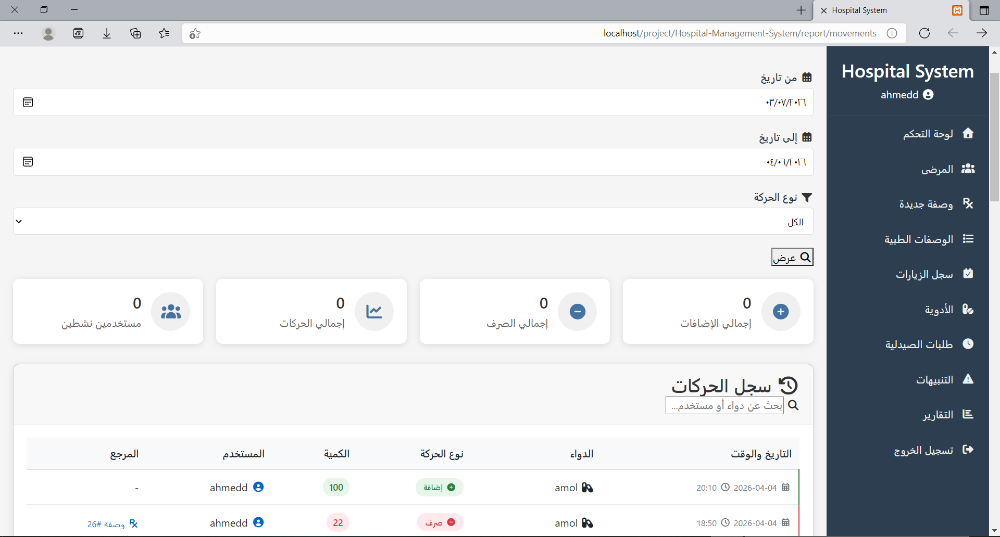

---

### 🔧 Troubleshooting

| Problem | Solution |
|---------|----------|
| Database connection error | Check credentials in `config/database.php` |
| White screen after login | Enable PHP error reporting: `ini_set('display_errors', 1);` |
| 404 on subpages | Verify mod_rewrite is enabled for Apache |
| SQL import fails | Ensure MySQL version 5.7+ and check file encoding |

---

🤝 Contributing

1. Fork the project
2. Create your feature branch (git checkout -b feature/AmazingFeature)
3. Commit changes (git commit -m 'Add AmazingFeature')
4. Push to branch (git push origin feature/AmazingFeature)
5. Open a Pull Request

---

📄 License

Distributed under the MIT License. See LICENSE file for more information.

---

📧 Contact

Ahmed Senan Al-Aini
GitHub: @Ahmed-Senan-Al-Aini
Project Link: https://github.com/Ahmed-Senan-Al-Aini/Hospital-Management-System

---
